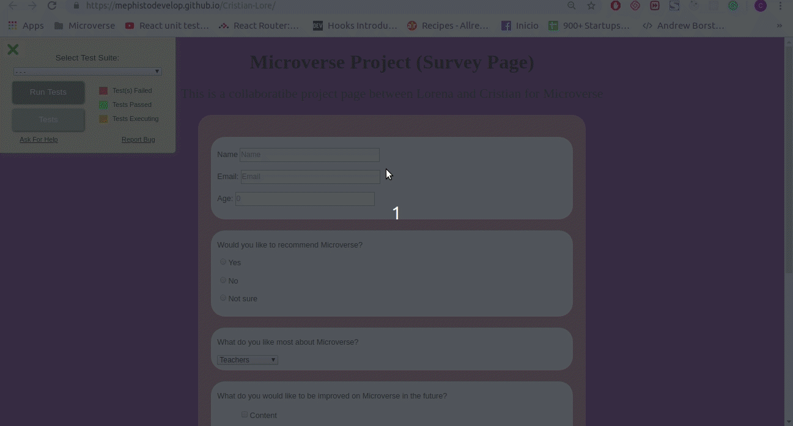

# HTML/CSS Survey Project

> Survey Page Created n colaborative to apply to Microverse School For Remote Software Developers using Visual Studio Code,HTML and CSS.

Built With HTML and CSS

## Live Demo

[Live Demo Link](https://mephistodevelop.github.io/Cristian-Lore/)

## Getting Started

To start to using this project you will need to download or copy this repository to your localhost or your pc and only open the index.html file on  your browser.

### Deployment

To deploy this proyect on your browser you only need to open the index.html file on your prefeer browser.

## Authors

👤 **Cristian Ines Hernandez A. - MephistoDevelop**

- Github: [@MephistoDevelop](https://github.com/MephistoDevelop)
- Twitter: [@MephistoDevelop](https://twitter.com/MephistoDevelop)
- Linkedin: [Cristian Hernandez](https://www.linkedin.com/in/cristian-hernandez1992/)

## 🤝 Contributing

Contributions, issues and feature requests are welcome!

Feel free to check the [issues page](issues/).

## Show your support

Give a ⭐️ if you like this project!

## 📝 License

This project is [MIT](lic.url) licensed.

### Author:

[Cristian Ines (MephistoDevelop)](https://github.com/MephistoDevelop)
